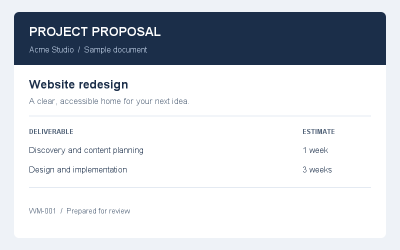
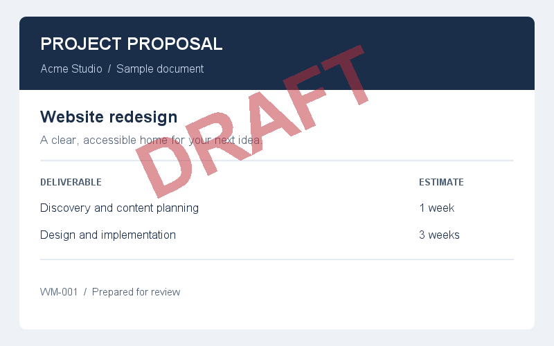

# WaterMarkIt

[](https://central.sonatype.com/artifact/io.github.watermark-lab/WaterMarkIt)
[](https://javadoc.io/doc/io.github.watermark-lab/WaterMarkIt)
[](https://deepwiki.com/OlegCheban/WaterMarkIt)
[](https://qlty.sh/gh/OlegCheban/projects/WaterMarkIt)
[](https://qlty.sh/gh/OlegCheban/projects/WaterMarkIt)
[](#requirements-and-installation)
[](LICENSE)

Add watermarks to PDFs, images, videos, and audio from Java through a type-safe fluent API.

WaterMarkIt handles PDF processing, audio mixing, and offline speech synthesis. Use it in a backend, a batch job, or a desktop application without adopting an application framework.

[Quick start](#quick-start) · [PDF](#pdf-watermarks) · [Images](#image-watermarks) · [Video](#video-watermarks) · [Audio](#audio-watermarks) · [Advanced usage](docs/advanced-usage.md) · [Contributing](#contributing)

## What you can build

- **Flexible watermark configuration:**  customize appearance, positioning, and multiple layers, with conditions that control watermarking for entire PDF documents or individual pages.
- **Branded visual content:** place text or a logo on images and videos, or tile a watermark across the content.
- **Audio previews:** mix an audible clip or an offline spoken message into an audio track at a chosen time.
- **Custom processing:** combine multiple watermark layers and replace processing services through Java's `ServiceLoader` SPI.

You can customize watermark font, color, size, position, rotation, and opacity. PDF pages can be rendered in parallel. Text watermarks can also include a superscript ® at the top right.

## Requirements and installation

Java 11 or higher is required.

### Maven

Add to `pom.xml`:

```xml
<dependency>
    <groupId>io.github.watermark-lab</groupId>
    <artifactId>WaterMarkIt</artifactId>
    <version>1.5.0</version>
</dependency>
```

### Gradle

Use `mavenCentral()` in your repositories configuration.

Groovy, in `build.gradle`:

```groovy
implementation 'io.github.watermark-lab:WaterMarkIt:1.5.0'
```

Kotlin, in `build.gradle.kts`:

```kotlin
implementation("io.github.watermark-lab:WaterMarkIt:1.5.0")
```

## Quick start

With the dependency installed, put an `input.pdf` in your application's working directory and run this class. It writes a new `output.pdf` with a translucent watermark.

```java
import com.markit.api.WatermarkService;
import com.markit.api.WatermarkingMethod;

import java.io.File;
import java.io.IOException;
import java.nio.file.Files;
import java.nio.file.Path;

public class WatermarkExample {
    public static void main(String[] args) throws IOException {
        byte[] result = WatermarkService.create()
            .watermarkPDF(new File("input.pdf"))
            .withText("DRAFT").end()
            .method(WatermarkingMethod.OVERLAY)
            .opacity(25)
            .apply();

        Files.write(Path.of("output.pdf"), result);
    }
}
```

`apply()` waits for processing to finish and returns the encoded result as `byte[]`.

## PDF watermarks

Portrait and landscape pages are supported, including PDFs with rotated pages.

### Choose a mode

| Mode | How it works | When to use it |
| --- | --- | --- |
| `OVERLAY` | Adds text or images to the existing page content. Existing text remains searchable and selectable. | Documents that must retain their text and vector content. The watermark remains separately editable PDF content. |
| `DRAW` (default) | Renders each affected page to an image, adds the watermark, and replaces the page content with that image. | Visual previews where a watermark should be harder to remove with standard PDF editing tools. Original page text is no longer searchable or selectable without OCR. |

`DRAW` uses 300 DPI by default. DPI affects image quality, memory use, processing time, and output size. Rasterization makes editing the watermark harder, but does not guarantee that it cannot be removed.

To select rasterization explicitly:

```java
byte[] result = WatermarkService.create()
    .watermarkPDF(new File("input.pdf"))
    .withText("CONFIDENTIAL").end()
    .method(WatermarkingMethod.DRAW)
    .dpi(150)
    .opacity(30)
    .apply();

Files.write(Path.of("preview.pdf"), result);
```

### Apply conditions

Each watermark can have its own page filter, document filter, and enable condition. Page indexes start at zero. In this example, all three conditions must match:

```java
boolean isOwner = false;

byte[] result = WatermarkService.create()
    .watermarkPDF(new File("input.pdf"))
    .withText("REVIEW COPY").end()
    .method(WatermarkingMethod.OVERLAY)
    .pageFilter(index -> index >= 1)
    .documentFilter(pdf -> pdf.getNumberOfPages() > 3)
    .enableIf(!isOwner)
    .apply();

Files.write(Path.of("review-copy.pdf"), result);
```

If a recipient should receive the original file unchanged, return the original directly from your application. Disabling a watermark does not mean that PDF loading and serialization are skipped.

For multiple layers, tiling, positioning, and parallel PDF rendering, see [advanced usage](docs/advanced-usage.md).

## Image watermarks

Add a translucent, rotated label to a PNG:

```java
import com.markit.api.positioning.WatermarkPosition;
import java.awt.Color;

byte[] result = WatermarkService.create()
    .watermarkImage(new File("input.png"))
    .withText("DRAFT").color(new Color(190, 45, 55)).bold().end()
    .position(WatermarkPosition.CENTER).end()
    .rotation(25)
    .size(65)
    .opacity(50)
    .apply();

Files.write(Path.of("preview.png"), result);
```

| Original PNG | WaterMarkIt output |
| --- | --- |
|  |  |

This comparison is generated by the library using the settings above. To use a logo, start the watermark with `withImage(new File("logo.png"))`. Use `and()` to add another text or image layer. 

## Video watermarks

Install [FFmpeg](https://ffmpeg.org/download.html), including `ffprobe`, and make both executables available on the application's `PATH`. Check from the same environment that launches your application:

```shell
ffmpeg -version
ffprobe -version
```

Your FFmpeg build must include the `libx264` encoder and the filters needed for the selected watermarks, such as `drawtext` and `overlay`. Text rendering also depends on fonts available to the application and FFmpeg.

```java
import com.markit.api.positioning.WatermarkPosition;

byte[] result = WatermarkService.create()
    .watermarkVideo(new File("input.mov"))
    .withText("PREVIEW").end()
    .position(WatermarkPosition.CENTER).end()
    .opacity(35)
    .size(30)
    .and()
    .withImage(new File("logo.png"))
    .position(WatermarkPosition.BOTTOM_RIGHT).end()
    .size(8)
    .apply();

Files.write(Path.of("preview.mp4"), result);
```

The default video implementation produces MP4 with H.264 video even when the input is MOV, AVI, or MKV. Processing re-encodes the video; it does not preserve the original video bitstream. Allow time and temporary disk space for media processing.

## Audio watermarks

Audio watermarks are audible layers mixed into the source track. FFmpeg must be installed and available on `PATH`.

Mix a clip at 25% of its original gain:

```java
byte[] result = WatermarkService.create()
    .watermarkAudio(new File("source.wav"))
    .withAudio(new File("chime.wav"))
    .volume(25)
    .apply();

Files.write(Path.of("preview.wav"), result);
```

Combine a clip with an offline spoken watermark, each starting at a different time:

```java
import com.markit.audio.tts.FreeTtsVoice;
import java.time.Duration;

byte[] result = WatermarkService.create()
    .watermarkAudio(new File("source.wav"))
    .withAudio(new File("chime.wav"))
    .volume(25)
    .startAt(Duration.ofSeconds(3))
    .and()
    .withText("Property of WaterMarkIt")
        .voice(FreeTtsVoice.KEVIN_16)
        .end()
    .volume(15)
    .startAt(Duration.ofSeconds(20))
    .apply();

Files.write(Path.of("spoken-preview.wav"), result);
```

- Multiple layers are mixed in one FFmpeg invocation. Each can use `enableIf(condition)`.
- `volume` accepts `0` to `100`: zero is silent, 100 is the watermark's original gain. It does not normalize the source; loud mixes may clip.
- Output duration matches the source. Delayed watermarks are truncated at its end.
- File sources select WAV, MP3, FLAC, M4A, AAC, OGG, Opus, or AIFF output based on their extension. Unknown extensions and `byte[]` sources produce WAV. FFmpeg detects input bytes by content; output is re-encoded.
- Speech uses offline FreeTTS with US-English `KEVIN_16` (16 kHz) by default; `KEVIN` (8 kHz) is also available. Custom languages and voices require a suitable `TextToSpeechEngine` and `TextToSpeechVoice` implementation.

## Integration notes

- **Inputs and results:** all four entry points accept `File` or `byte[]`. PDF also accepts a PDFBox `PDDocument`. Results are returned as a complete byte array, so account for heap usage when processing large files.
- **PDF ownership:** `apply()` closes the PDF document, including a `PDDocument` supplied by your application. Treat a PDF builder and its document as one operation.
- **Executors:** `create()` processes PDF pages sequentially. `create(executor)` submits `DRAW` page tasks to the supplied executor and waits for completion. Your application owns and shuts down that executor; `OVERLAY` processing remains sequential.
- **Configuration:** `end()` finishes text or position configuration; `and()` starts another watermark with fresh defaults. PDF `method(...)` applies to the current watermark, so set it on each layer when combining overlays.
- **Visual values:** opacity is a percentage from 0 to 100; size accepts 0 to 300 and is interpreted by the selected renderer. It is not a universal font-point size or scale percentage across all formats.
- **Runtime dependencies:** Maven or Gradle resolves PDFBox, JAI Image I/O, FreeTTS, and the Kotlin standard library transitively. Java applications do not need Kotlin source or a Kotlin compiler. FFmpeg is installed separately.
- **Extensions:** replace a renderer, font provider, FFmpeg service, or speech engine through `ServiceLoader`.

## Releases and API compatibility

Use [release notes](https://github.com/OlegCheban/WaterMarkIt/releases) to review changes and select the matching version in [Javadoc](https://javadoc.io/doc/io.github.watermark-lab/WaterMarkIt). Pin the dependency version in your application.

Start integrations through `com.markit.api.WatermarkService`. Implement the documented SPI interfaces when extending processing; review changes to those interfaces when upgrading. Source-tree documentation can include APIs that are not in the dependency version you currently use.

## Contributing

Help make watermarking easier to integrate and more predictable across real documents and media.

Browse [good first issues](https://github.com/OlegCheban/WaterMarkIt/issues?q=is%3Aissue%20is%3Aopen%20label%3A%22good%20first%20issue%22) or [help wanted](https://github.com/OlegCheban/WaterMarkIt/issues?q=is%3Aissue%20is%3Aopen%20label%3A%22help%20wanted%22). If there is no suitable labeled issue, the [first contribution ideas](CONTRIBUTING.md#choose-a-first-contribution) describe small tasks, where to work, and what a finished contribution should demonstrate.

Useful contributions include runnable examples, documentation, small reproducible media fixtures, regression tests, and processing improvements. Areas to explore include PNG transparency, PDF text preservation, and FFmpeg setup across operating systems.

Read the [contributor guide](CONTRIBUTING.md) for local setup, the package map, tests, and the PR checklist. For a larger feature, open an issue describing the use case and proposed API so its scope can be discussed before implementation.

## Help and feedback

Use [GitHub Issues](https://github.com/OlegCheban/WaterMarkIt/issues) for questions, bug reports, and feature requests. For a processing problem, include the library version, JDK, OS, a minimal code example, expected and actual output, and a small shareable input file. For audio or video, include the FFmpeg version and relevant error output.

Thanks to everyone who contributes code, examples, tests, and feedback. See the [project contributors](https://github.com/OlegCheban/WaterMarkIt/graphs/contributors).

## License

WaterMarkIt is available under the [MIT License](LICENSE).
